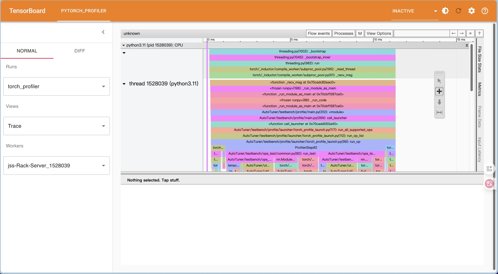

# Quick Start

## Pre-Requirements

Followed the [install guides](./Install.md)

Followed [.secrets/env_sample.sh](../.secrets/env_sample.sh), create an `env.sh` in the same directory to hold your config.

## To Try Collect Data

Run [tests/functional_test/testbench_collect_data.sh](../tests/functional_test/testbench_collect_data.sh), modify the configs to follow your environment.

The outputs like:

```sh
(megatron-lm-autotuner) ➜  Megatron-LM-AutoTuner git:(main) ls outputs/2025-10-15_17-48-12/Qwen/Qwen3-0.6B/collect_data                  
rank_0  rank_1  rank_2  rank_3
```

## To Try Torch Profiler

Run [tests/functional_test/testbench_torch_profile.sh](tests/functional_test/testbench_torch_profile.sh), modify the configs to follow your environment.

After finish, you can check output dir:

```sh
(megatron-lm-autotuner) ➜  Megatron-LM-AutoTuner git:(main) ✗ ls outputs/2025-10-17_16-22-50/Qwen/Qwen3-0.6B/torch_profiler                                                        
jss-Rack-Server_1528039.1760689383431851581.pt.trace.json  jss-Rack-Server_1528040.1760689383437475633.pt.trace.json  jss-Rack-Server_1528041.1760689383439235537.pt.trace.json  jss-Rack-Server_1528042.1760689383440949434.pt.trace.json
```

Then run:

```
pip install torch_tb_profiler

tensorboard --logdir=outputs/2025-10-17_16-22-50/Qwen/Qwen3-0.6B/torch_profiler --host 0.0.0.0
```

Open your browser and go to `http://[ip]:6006/#pytorch_profiler`, you will see the traces in `Views` tabs, use `WASD` to check the traces.

